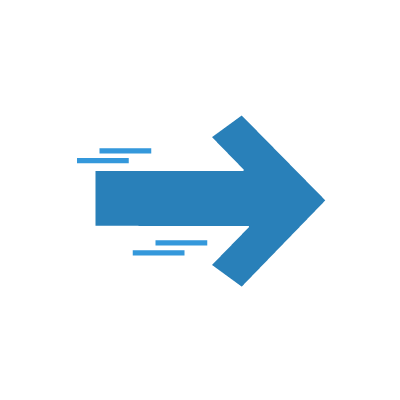

<!--
*** Thanks for checking out the Best-README-Template. If you have a suggestion
*** that would make this better, please fork the repo and create a pull request
*** or simply open an issue with the tag "enhancement".
*** Thanks again! Now go create something AMAZING! :D
***
***
***
*** To avoid retyping too much info. Do a search and replace for the following:
*** github_username, repo_name, twitter_handle, email, project_title, project_description
-->


<!-- PROJECT SHIELDS -->
<!--
*** I'm using markdown "reference style" links for readability.
*** Reference links are enclosed in brackets [ ] instead of parentheses ( ).
*** See the bottom of this document for the declaration of the reference variables
*** for contributors-url, forks-url, etc. This is an optional, concise syntax you may use.
*** https://www.markdownguide.org/basic-syntax/#reference-style-links
-->


<!-- PROJECT LOGO -->
<br />
<p align="center">
  <a href="https://github.com/NxT-Media-Technology/canvas-student-announcement-discord-bot">
    
    
    
  </a>

  <h3 align="center">Canvas Student Announcement Discord Bot</h3>

  <p align="center">
    A discord bot linked with the Canvas Student API that gives the possibility to watch specific courses and embed posts when there are new announcements for these courses.
    <br />
    <br />
    <a href="https://github.com/NxT-Media-Technology/canvas-student-announcement-discord-bot/issues">Report Bug</a>
    ·
    <a href="https://github.com/NxT-Media-Technology/canvas-student-announcement-discord-bot/issues">Request Feature</a>
  </p>
</p>


<!-- TABLE OF CONTENTS -->
<details open="open">
  <summary><h2 style="display: inline-block">Table of Contents</h2></summary>
  <ol>
    <li>
      <a href="#about-the-project">About The Project</a>
      <ul>
        <li><a href="#built-with">Built With</a></li>
      </ul>
    </li>
    <li>
      <a href="#getting-started">Getting Started</a>
      <ul>
        <li><a href="#prerequisites">Prerequisites</a></li>
        <li><a href="#installation">Installation</a></li>
        <li><a href="#usage">Usage</a></li>
      </ul>
    </li>
    <li><a href="#commands">Commands</a></li>
    <li><a href="#make-your-own-command">Make Your Own Command?</a></li>
    <li><a href="#contributing">Contributing</a></li>
    <li><a href="#license">License</a></li>
    <li><a href="#contact">Contact</a></li>
    <li><a href="#acknowledgements">Acknowledgements</a></li>
  </ol>
</details>


<!-- ABOUT THE PROJECT -->
## About The Project

<!-- [![Product Name Screen Shot][product-screenshot]](https://example.com) -->

This project has been made for our school discord server, we use discord as our main communication platform in these times of COVID-19. That's why we decided to make it a little bit easier for every one to follow-up their courses on the same platform.


### Built With

* [DiscordJS](https://discord.js.org/#/)
* [Discord Developer](https://discord.com/developers/applications)
* [Canvas Student API](https://canvas.instructure.com/doc/api/)
* [SQLite](https://www.sqlite.org/index.html)
* [NodeJS](https://nodejs.org/en/)


<!-- GETTING STARTED -->
## Getting Started

To get up and running follow these simple steps.

### Prerequisites

* Download/Install the latest version of NodeJS (Includes NPM)
  ```sh
  https://nodejs.org/en/
  ```

### Installation

1. Clone the repo
   ```sh
   git clone https://github.com/NxT-Media-Technology/Canvas-Student-Announcement-Discord-Bot/
   ```
2. Navigate into your cloned folder
   ```sh
   cd "Drive:/folder/folder/canvas-student-discord-bot"
   ```
3. Install NPM packages
   ```sh
   npm install
   ```


<!-- USAGE EXAMPLES -->
## Usage

Before you can actually use your bot you'll have to fill in some parameters in the .env file:

1. Rename the **.env.example** to **.env**
2. In the .env file replace all the text between < > by your parameter values </br>
   *:heavy_exclamation_mark: Make sure that the Canvas Token has access to all the available courses :heavy_exclamation_mark:*
    ```sh
    DISCORD_TOKEN='<https://discord.com/developers/applications>'
    CANVAS_TOKEN='<https://<YOUR CANVAS DOMAIN>/profile/settings>' 

    CANVAS_API_COURSES_URL='https://<YOUR CANVAS DOMAIN>/api/v1/courses?enrollment_state=active&'
    CANVAS_API_COURSE_URL='https://<YOUR CANVAS DOMAIN>/api/v1/courses/'
    CANVAS_API_ANN_URL='https://<YOUR CANVAS DOMAIN>/api/v1/announcements?context_codes[]=course_'
    ```
3. Run the node server
    ```sh
    node bot.js
    ```


<!-- COMMANDS -->
## Commands

- `.courses <page>` or `.cs <page>` - List all the courses that the bot has access to.
- `.watchlist` or `.wl` - List all the courses that are being tracked in the current textchannel.
- `.addCourse <course_id>` or `.ac <course_id>` - Add the selected course to the watchlist of this channel.
- `.remove <course_id>` or `.rm <course_id>` - Remove course from the watchlist of this channel.
- `.poll` - Create a poll on the latest post (with Thumb Emojis).
- `.ping` - Responds with **pong** message, indicates if the bot is online.

<!--MAKE YOUR OWN COMMAND? -->
## Make Your Own Command?

In the Commands folder you will find a js file named [template.js](commands/template.js). If you want to make your own command just copy and paste this file inside the commands folder.  

- `commands: ["template", "t"]` - Name and Alias Of your command.
- `expectedArgs: ["<arg1> <arg2> <arg3>"]` - Expected arguments for your command.
- `permissionError: "You Have no permissions to run this command",` - The permission error it returns if the person running the command doesn't have the permission to use the command.
- `minArgs: 1` - Minimum required arguments. Example: `!template arg1`  
- `maxArgs: 3` - Maximum required arguments. Example: `!template arg1 arg2 arg3`
- `callback: (message, arguments, text) => {}` - This is what is called when u run the command.
- `permissions: []` - Only allows users with certain permission to run this command. Example: `permissions: ["ADMINISTRATOR"]`-> This wil only allow server admins.
- `requiredRoles: []` - Only allows users with certain roles to run this command. Example: `requiredRoles: ["Ping"]`-> This wil only allow users with role Ping.


<!-- CONTRIBUTING -->
## Contributing

Contributions are what make the open source community such an amazing place to be learn, inspire, and create. Any contributions you make are **greatly appreciated**.

1. Fork the Project
2. Create your Feature Branch (`git checkout -b feature/AmazingFeature`)
3. Commit your Changes (`git commit -m 'Add some AmazingFeature'`)
4. Push to the Branch (`git push origin feature/AmazingFeature`)
5. Open a Pull Request


<!-- LICENSE -->
## License

Distributed under the Apache License. See `LICENSE`for more information.


<!-- CONTACT -->
## Contact

Noah Gillard - [@NoahGillard1](https://twitter.com/NoahGillard1) - noah.gillard@student.kdg.be

Wouter Thys - wouter.thys@student.kdg.be


<!-- ACKNOWLEDGEMENTS -->
## Acknowledgements

* [Worn Off Keys](https://www.youtube.com/watch?v=gV4iltEdBs4&list=PLaxxQQak6D_fxb9_-YsmRwxfw5PH9xALe): An in-depth discord.js tutorial
* [DiscordJS Docs](https://discordjs.guide/)
* [README Template](https://github.com/othneildrew/Best-README-Template/blob/master/BLANK_README.md) - Made By [Othneil Drew](https://github.com/othneildrew)


<!-- MARKDOWN LINKS & IMAGES -->
<!-- https://www.markdownguide.org/basic-syntax/#reference-style-links -->
<!-- [contributors-shield]: https://img.shields.io/github/contributors/github_username/repo.svg?style=for-the-badge
[contributors-url]: https://github.com/github_username/repo/graphs/contributors
[forks-shield]: https://img.shields.io/github/forks/github_username/repo.svg?style=for-the-badge
[forks-url]: https://github.com/github_username/repo/network/members
[stars-shield]: https://img.shields.io/github/stars/github_username/repo.svg?style=for-the-badge
[stars-url]: https://github.com/github_username/repo/stargazers
[issues-shield]: https://img.shields.io/github/issues/github_username/repo.svg?style=for-the-badge
[issues-url]: https://github.com/github_username/repo/issues
[license-shield]: https://img.shields.io/github/license/github_username/repo.svg?style=for-the-badge
[license-url]: https://github.com/github_username/repo/blob/master/LICENSE.txt
[linkedin-shield]: https://img.shields.io/badge/-LinkedIn-black.svg?style=for-the-badge&logo=linkedin&colorB=555
[linkedin-url]: https://linkedin.com/in/github_username
 -->
